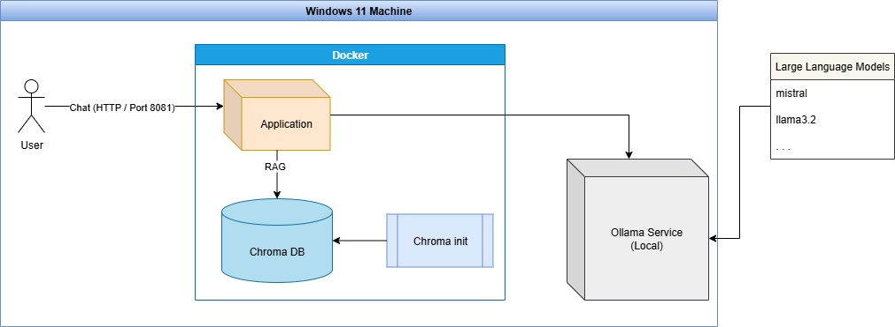

# Spring AI - Ollama Chat with Retrieval Augmented Generation (RAG)
The bare minimum setup required to chat with your locally running Ollama AI models using Retrieval-Augmented Generation (RAG). Any file you provide containing private or domain-specific knowledge is stored in the ChromaDB vector store, and the Large Language Model leverages that context to generate responses. This is particularly useful when you need to ask about the details of a contract or request a summary of a report. At present, the project supports .txt files, but it can be easily extended to handle other formats such as PDF, CSV, Excel, and Word documents.

## Architecture



## Pre-requisites:

- Java 21
- Docker
- Ollama

## Install ollama

Download and install Ollama
-  here: https://ollama.com/. 

This will allow you to run AI models locally on your computer. See documentation here:
- https://docs.ollama.com/

Pull a model by running the followind command in your CMD prompt:
- ```ollama pull mistral```

Make sure you also have mistral as it is the default used by Spring AI
- ```ollama pull mistral:latest```

_Note: This project uses mistral by default but you can change to a model of your choice by updating application.properties. Ensure that you have pulled the model of your choice before attempting to run this Java project._

## Start infrastructure
```mvn package install```
or
```docker compose up --build```

## Destroy infrastructure
```mvn clean```
or
```docker compose down```

## Cleanup Docker (optional)
```docker system prune -f```
then
```docker network prune -f```
and finally
```docker volume prune -f```

## Developer details
- Brian Lukonsolo